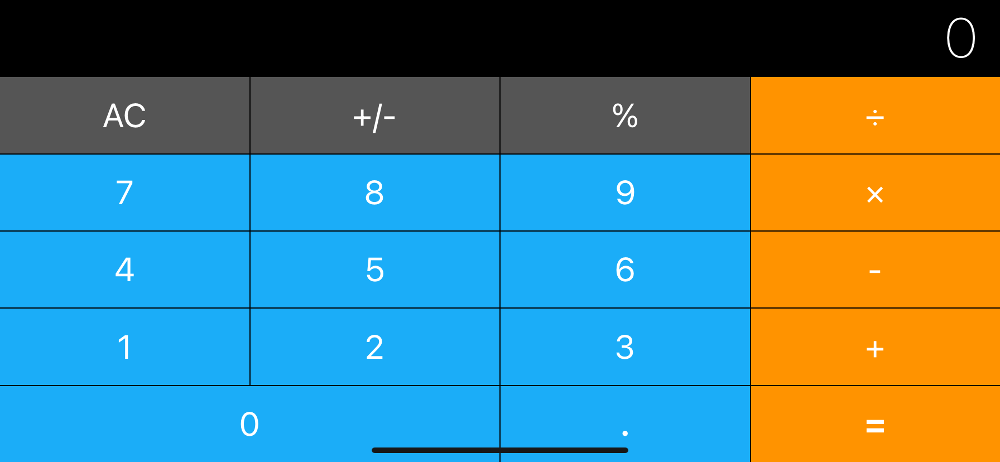

Calculator Design, Developed by Sebastian Güiza, using Xcode and App Brewery

# *** Calculator Design ***

Calculator Design allow you change from Portrait to Landscape or from Landscape to Portrait

What I learned in this module was:

* How to add constraints and understanding how Auto Layout works.
* How to Pin and Align elements.
* How to create containers to configure advanced layouts.
* How to debug auto layout errors.
* Understanding what Xcode needs in order to correctly layout a design.
* How to use Stack Views to create complex interfaces.

Everybody who wants to use this application, ¡¡¡ 

# Enjoy it !!!

